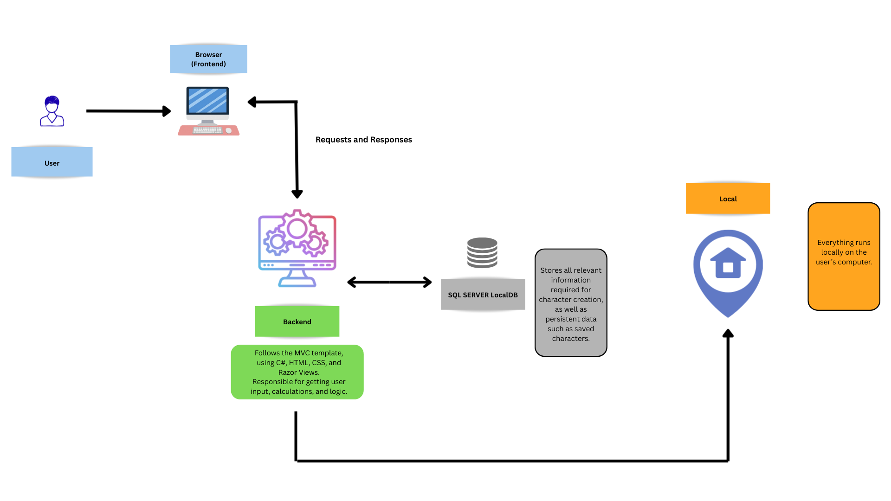
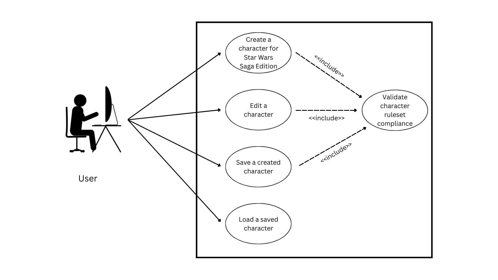
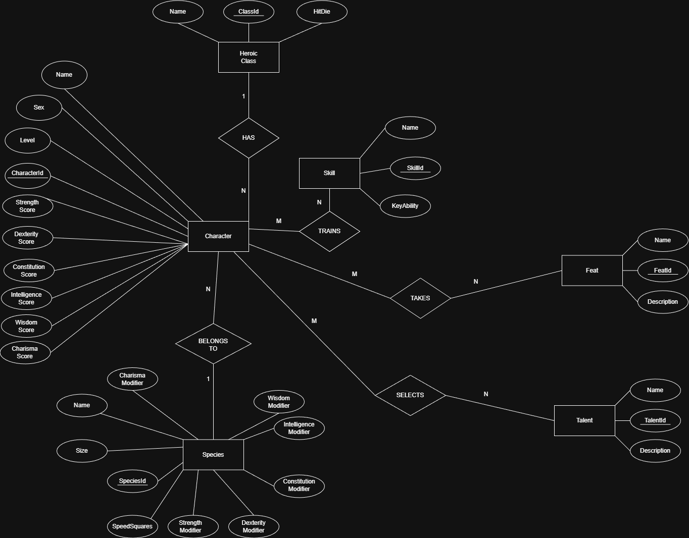
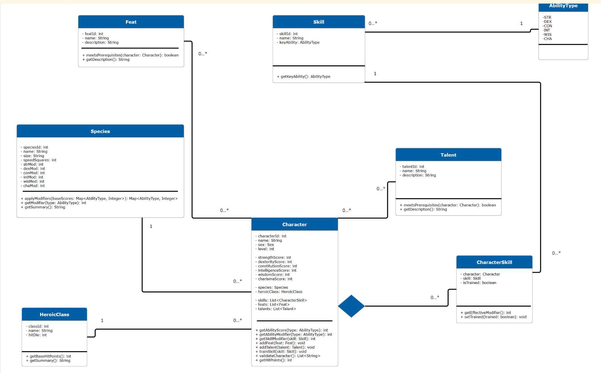

# SWSE-Character-Creator

## Table of Contents
- [Purpose of the Application](#purpose-of-the-application)
- [Functional Requirements](#functional-requirements)
- [Sources](#sources)
- [Description of Application](#description-of-application)
- [Wireframe Sketches](#wireframe-sketches)
- [Solution Architecture Diagram](#solution-architecture-diagram)
- [User Stories](#user-stories)
- [Use-Cases](#use-cases)
- [UML Use-Case Diagram](#uml-use-case-diagram)
- [Software Requirements Table](#software-requirements-table)
- [Entity Relationship Diagram](#entity-relationship-diagram)
- [UML Class Diagram](#uml-class-diagram)

## **Project Description**
### Purpose of the Application:
Saga Edition Character Creator’s primary objective is to streamline the process of creating a character. Star Wars Saga Edition, like most tabletop roleplaying games, relies on a variety of books to provide rules, playable species, skills, feats, talents, heroic classes, prestige classes, equipment, Force powers, Force secrets, lightsaber forms, and languages. Developing a digital method to create one’s character eliminates the physical requirement of pencil and paper, reduces time spent searching through each book, and displays all relevant information to the user. In addition, players will never have to worry about losing their character sheets, since they will all be saved. This application will save hours of time for those creating characters.\

## Functional Requirements:
Functional Requirements:
Saga Edition Character Creator is designed to follow Star Wars Saga Edition’s ruleset. The user will be able to create, save, edit, and delete characters. When creating a character, they will select their:\
•	Species\
•	Heroic Class\
•	Skills\
•	Feats\
•	Talents\
•	Ability Scores (strength, dexterity, constitution, intelligence, wisdom, charisma)\
Those are among the first things a user would select; however, there is more. Characters are comprised of statistics as well, which are:\
•	Hit Points (calculated by constitution score and heroic class)\
•	Fortitude Defense (calculated by constitution score, heroic class, feats)\
•	Reflex Defense (calculated by dexterity score, heroic class, feats)\
•	Will Defense (calculated by wisdom score, heroic class, feats)\
•	Base Attack Bonus (calculated by ability scores and heroic class)\
•	Skill Modifiers (calculated by ability scores, feats, and talents)\
All of these will automatically be calculated, as the application will factor in all relevant information associated with said statistics. 
As it pertains to the ruleset, the system will ensure correct character assembly. For example, a user selects Jedi as their character’s heroic class. Jedi do not get access to the Deception skill; therefore, the user will not be able to choose Deception as one of that character’s skills.
Each character will be able to be viewed at the user’s leisure in an easily readable digital format.

## Sources:
Relevant Literature and Sources:
Saga Edition Character Creator adheres to the ruleset determined in the Star Wars Saga Edition tabletop role-playing game. Star Wars Saga Edition has fourteen official sourcebooks and one campaign, all of which will be used as sources. These sources are:
1.	Saga Edition Core Rulebook
2.	Starships of the Galaxy
3.	Threats of the Galaxy
4.	Knights of the Old Republic Campaign Guide
5.	Force Unleashed Campaign Guide
6.	Scum and Villainy
7.	Clone Wars Campaign Guide
8.	Legacy Era Campaign Guide
9.	Jedi Academy Training Manual
10.	Rebellion Era Campaign Guide
11.	Galaxy at War
12.	Scavenger’s Guide to Droids
13.	Galaxy of Intrigue
14.	The Unknown Regions
15.	Dawn of Defiance
16. https://swse.fandom.com/wiki/Star_Wars_Saga_Edition_Wikia  

## Description of Application
An application for creating characters in Star Wars Saga Edition.
HTML, CSS, SQL-SERVER, ASP.NET, C#, MVC,
TTRPG\

## Wireframe Sketches
  

## Solution Architecture Diagram
  

## User Stories
### User Story 1: Create a New Character
As a player, 
I want to create a new character for Star Wars Saga Edition,
So that I can begin playing Star Wars Saga Edition.

### User Story 2: Save a Character
As a player,
I want to save a character,
So that I have access to it in the future.

### User Story 3: Load an Existing Character
As a player,
I want to load an existing character,
So that I can view or edit it.

### User Story 4: Delete a Character
As a player,
I want to delete a character,
So that I can remove any characters that have died.

### User Story 5: Edit a Character
As a player,
I want to edit a character,
So that I can update the character whenever it needs updating.

### User Story 6: Calculate Character Statistics Automatically
As a player,
I want to calculate character statistics automatically,
So that I do not have to perform manual calculations.

### User Story 7: Prevent Illegal Characters
As a player,
I want to prevent illegal characters,
So that I do not mistakenly create something that is unplayable.  

## Use-Cases
### Use-Case 1: Create a Character
Actor: User\
Description: The user creates a new character by selecting the character's species, ability scores, class, feats, skills, and talents. The application will validate the character by ensuring it adheres to the ruleset, and calculates various statistics.
---
### Use-Case 2: Edit a Character
Actor: User\
Description: The user edits an existing character by changing skills, feats, talents, or ability scores. The application ensures any changes adhere to the ruleset.
---
### Use-Case 3: Save a Character
Actor: User\
Description: The user saves a character locally. The system validates the character data and makes the data persistent in the event of future retrieval.
---
### Use-Case 4: Load a Character
Actor: User\
Description: The user loads an existing character from the local database.
---
### Use-Case 5: View a Character
Actor: User\
Description: The user views the digital character sheet of an existing character. All statistics and information are displayed.
---  

## (UML) Use-Case Diagram

## Software Requirements Table
| ID | Requirement |
|----|-------------|
| 1 | Provide the ability to create a new character |
| 1.1 | The system shall provide an interface for character creation |
| 1.1.1 | The system shall allow the user to enter a character name |
| 1.1.2 | The system shall allow the user to select a species |
| 1.1.3 | The system shall allow the user to select a heroic class |
| 1.1.4 | The system shall allow the user to enter ability scores |
| 1.1.5 | The system shall allow the user to view the selected character attributes before saving |
| 1.2 | The system shall store the entered character data in memory until the user chooses to save |

| 2 | Provide the ability to save a character |
| 2.1 | The system shall allow the user to save a created or edited character |
| 2.1.1 | The system shall store character data in persistent storage |
| 2.1.2 | The system shall assign a unique identifier to each saved character |
| 2.1.3 | The system shall store all character attributes including species, class, ability scores, feats, talents, skills, and any other selected data |

| 3 | Provide the ability to load an existing character |
| 3.1 | The system shall display a list of saved characters |
| 3.1.1 | The system shall display the name of each saved character |
| 3.1.2 | The system shall allow the user to select a character from the list |
| 3.1.3 | The system shall load the selected character’s data |
| 3.1.4 | The system shall display the loaded character’s information for viewing or editing |

| 4 | Provide the ability to delete a character |
| 4.1 | The system shall allow the user to select a saved character for deletion |
| 4.1.1 | The system shall provide a delete option for each saved character |
| 4.1.2 | The system shall remove the selected character from persistent storage |
| 4.1.3 | The system shall update the displayed list of saved characters after deletion |
| 4.1.4 | The system shall optionally confirm the deletion before removing the character |

| 5 | Provide the ability to edit a character |
| 5.1 | The system shall allow the user to modify an existing character |
| 5.1.1 | The system shall allow the user to modify character attributes such as ability scores, talents, skills, or feats |
| 5.1.2 | The system shall allow the user to save the updated character |
| 5.1.3 | The system shall update the stored character data after edits are saved |

| 6 | Provide automatic calculation of character statistics |
| 6.1 | The system shall automatically calculate character statistics |
| 6.1.1 | The system shall calculate statistics based on ability scores and other character attributes |
| 6.1.2 | The system shall automatically update calculated values when character attributes change |
| 6.1.3 | The system shall display calculated statistics to the user |
| 6.1.4 | The system shall prevent user modification of automatically calculated statistics |

| 7 | Prevent creation of illegal characters |
| 7.1 | The system shall validate character selections according to the Star Wars Saga Edition ruleset |
| 7.1.1 | The system shall enforce valid ability score values |
| 7.1.2 | The system shall validate character class selection according to implemented game rules |
| 7.1.3 | The system shall ensure that all required character fields are completed before saving |
| 7.1.4 | The system shall display an error message when an invalid selection is made |
| 7.1.5 | The system shall prevent saving a character that violates the game ruleset |
| 7.1.6 | The system shall validate feat prerequisites based on character level, ability scores, class features, and previously selected feats |
| 7.1.7 | The system shall prevent selection of feats for which the character does not meet all prerequisites |
| 7.1.8 | The system shall validate talent prerequisites based on class, level, and previously selected talents or features |
| 7.1.9 | The system shall prevent selection of talents for which the character does not meet all prerequisites |
| 7.1.10 | The system shall validate skill availability based on the selected heroic class |
| 7.1.11 | The system shall prevent assignment of trained skills that are not available to the selected heroic class |
| 7.1.12 | The system shall revalidate all dependent character options whenever a relevant character attribute or selection is modified |
| 7.1.13 | The system shall notify the user when a change causes an existing feat, talent, or skill selection to become invalid |

## Entity Relationship Diagram

## UML Class Diagram

